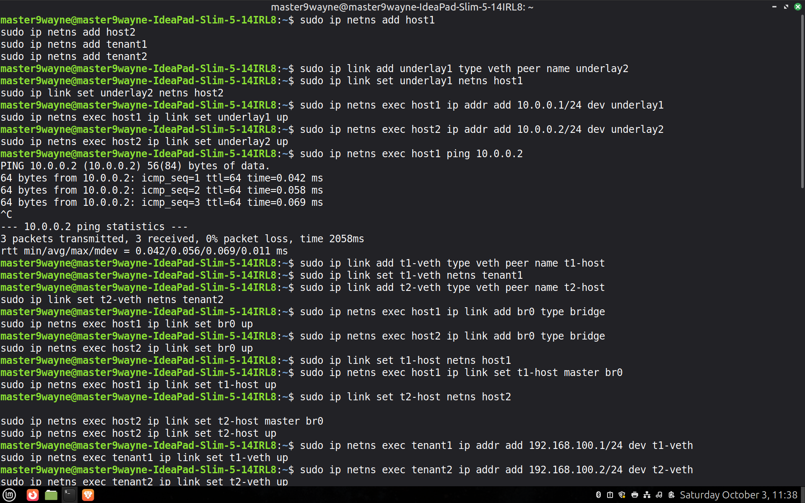
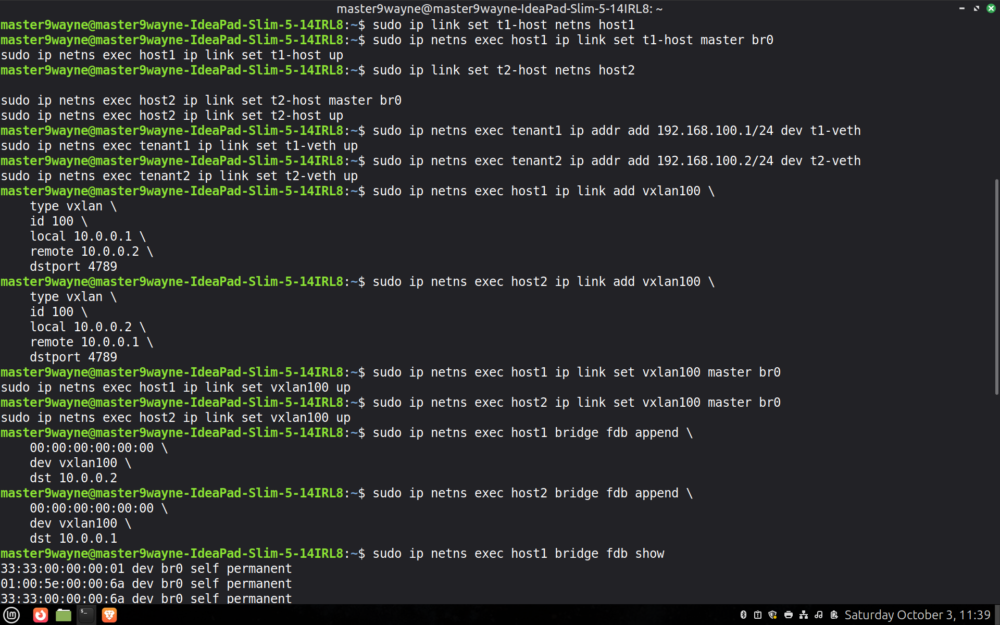
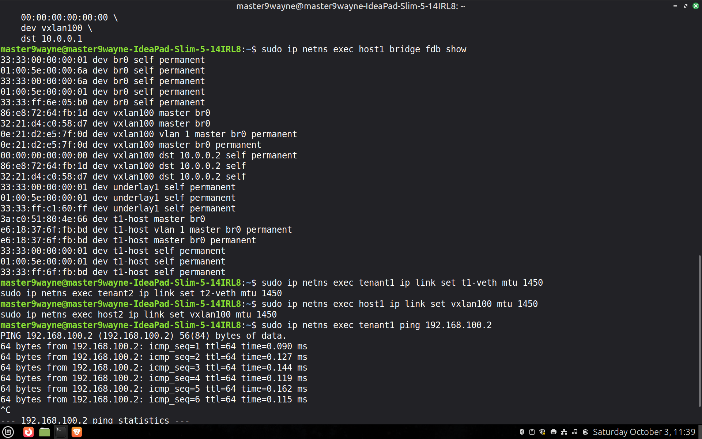

# WEC-SYSTEMS-eBPF-Task
## Task-1: Create the topology and VXLAN(Virtual Extensible LAN) overlay

### What was Done?
* We have two Linux hosts, host1 and host2. Each host contains a Linux bridge and a VXLAN interface. tenant1 is connected to the bridge on host1, while tenant2 is connected to the bridge on host2.
* The bridges provide the local Layer-2 connectivity between the tenant and the VXLAN interface. The VXLAN interfaces on host1 and host2 form the overlay tunnel between the two hosts.
* When tenant1 sends an Ethernet frame to tenant2, the frame first reaches the bridge on host1. The bridge forwards it to the VXLAN interface, which encapsulates the Ethernet frame sn IP pecket and sends it through the underlay network to host2.
* On host2, the VXLAN interface decapsulates the packet and gives the original Ethernet frame to the bridge. The bridge then forwards it to tenant2.
* Thus, even though tenant1 and tenant2 are physically on different hosts, the VXLAN overlay makes them behave as if they are connected to the same Layer-2 LAN.
* So the underlay provides the IP connectivity for the endpoints of VXLAN while the overlay is the virtual network over both hosts.

### Linux Commands:

* Added the 4 namespaces host1, host2, tenant1 and tenant2.
* Created the underlay connection using veth pairs.
* Configured the IP addresses for Underlay network.
* Created the Tenant Interfaces.
* Created Bridges and then put the tenant side interface into the bridges.

* Configured IP addresses for tenant1 and tenant2.
* Created VXLAN interface on host1.
* Created VXLAN interface on host2.
* Connected VXLAN to the bridges.
* Configured FDB entries.

* Displayed the FDB table entries.
* Configured MTU for the links.
* Ping test for checking connectivity between tenant1 and tenant2.
