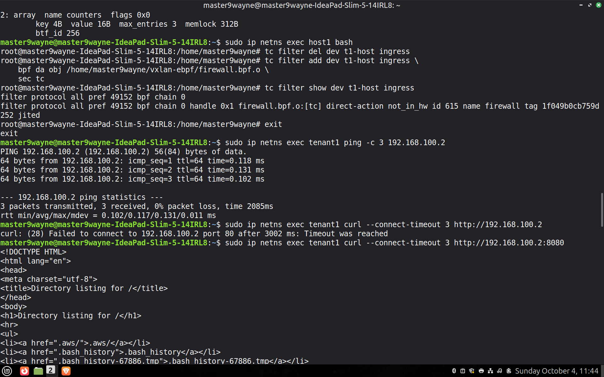
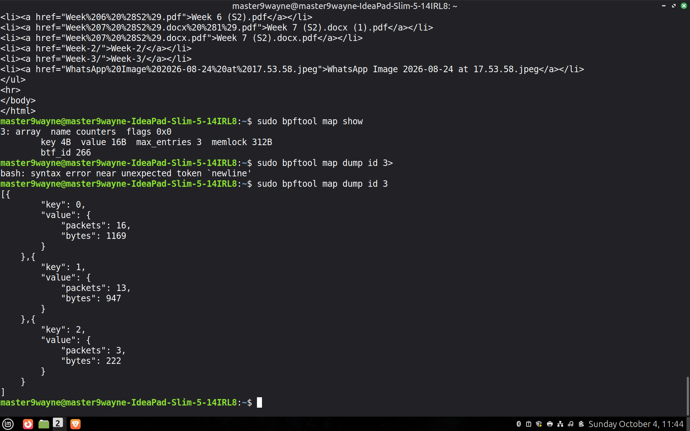

# WEC-SYSTEMS-eBPF-Task
## Task-2: Implement eBPF Packet Processing and traffic policy

### What I Implemented

* I attached a **TC eBPF program to the tenant-facing interface (`t1-host`)**, allowing packets to be inspected before they enter the bridge.

* The eBPF program implements a simple HTTP traffic filtering policy. It parses the Ethernet, IPv4, and TCP headers and checks whether the **TCP destination port is 80**. If the destination port is 80, the packet is dropped using `TC_ACT_SHOT`, otherwise, the packet is allowed using `TC_ACT_OK`.

* I created an **eBPF map** to maintain packet statistics, including the total number of packets, allowed packets, and dropped packets. eBPF programs execute independently for each packet and do not maintain persistent state by themselves, BPF maps are used to store and maintain data across program invocations.

* To demonstrate the filtering policy, I ran two HTTP servers in `tenant2`: one on **port 80** and another on **port 8080**. Traffic destined for port 80 was successfully dropped by the eBPF program, while traffic destined for port 8080 was allowed to pass through.

### Screenshots:

* Added eBPF program as TC filter on ingress.
* Checked connectivity using Ping.
* Used curl to fetch packets from HTTP Server on port 80. All packets were dropped.
* Packets from HTTP Server on port 8080 were allowed.

* Displayed bpf map's data to show the total number of packets, allowed and dropped packets.
