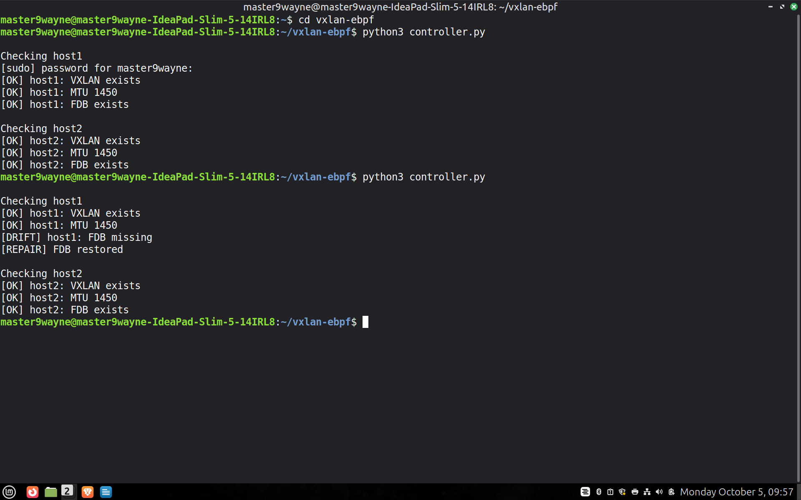
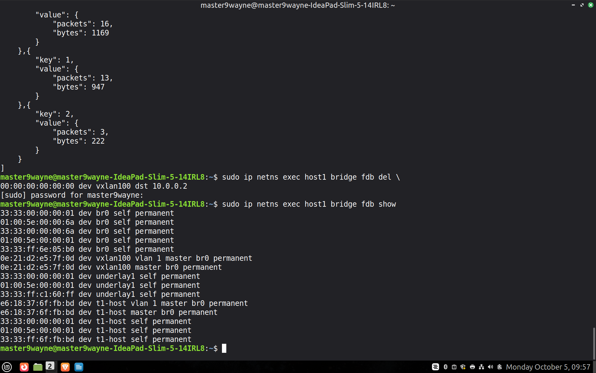

# WEC-SYSTEMS-eBPF-Task
## Build a lightweight network controller:

### What I have Implemented:
* The controller python file stores the desired configuration for each host. It stores VXLAN interface, MTU and FDB entries.
* Created run() helper function to run commands inside network namespace.
* If a FDB entry is missing, it repairs it and brings back to desired state.
* Repairs MTU to original value also.
* Running the controller again and again does not make unnecessary changes.
* It uses iproute2 utilities: ip and bridge. ip for executing commands in netns, showing VXLAN interface and setting MTU when it is incorrect. Bridge for showing FDB entries and repairing it.

### Limitations:
* The controller assumes that the configuration already exists.
* It verifies VXLAN interface but does not check the parameters.
* Bridge configuration is not reconciled.
* The controller does not modify eBPF policies.
* It's not continuously monitoring and needs to be invoked again and again.

### Screenshots:

* The script's output before and after deleting a FDB entry.

* Command to delete FDB entry.
